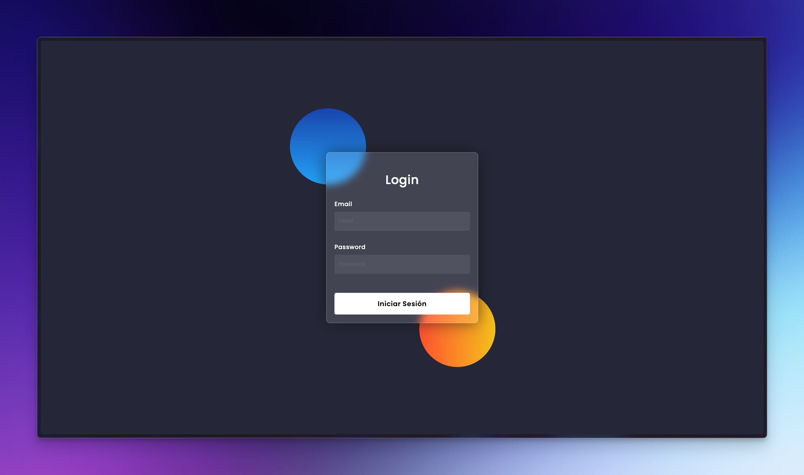

  

# Gestion Usuarios

Este proyecto consiste en una web que permita gestionar administradores , en primer lugar se registrará un super administrador en la instalación , y posteriormente este super administrador será el único que podrá ir agregando administradores de minijuegos , cada administrador de minijuegos tendrá acceso a un minijuego en concreto para gestionarlo.
